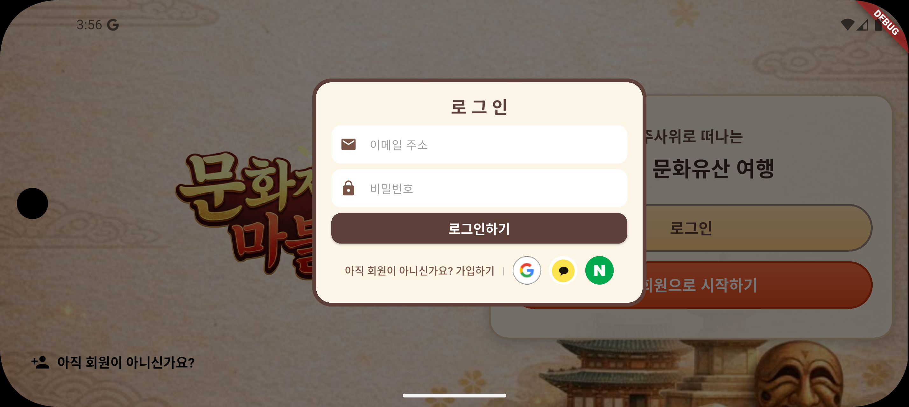
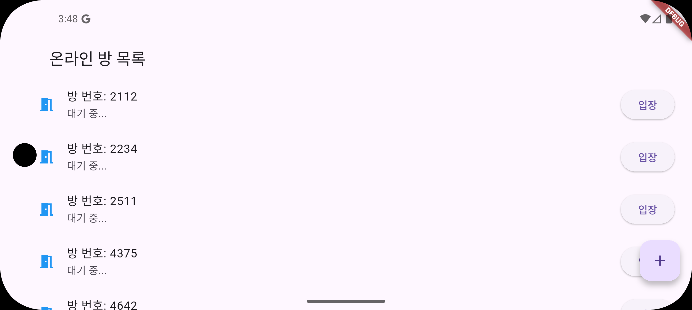
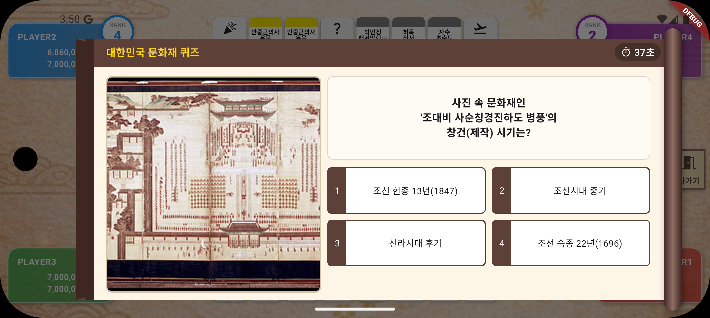

<p align="center">
  
</p>

# 🏯 문화재 마블

> **"주사위로 떠나는 우리 문화유산 여행"**  
> 공공데이터 API와 실시간 통신 기술을 활용한 한국 전통 테마의 보드게임 프로젝트입니다.

---

## 📌 프로젝트 개요
- **개발 기간**: 2025.12.22 ~ 2026.01.08
- **개발 환경**: Flutter (Dart), Firebase, Node.js (Socket.io)
- **핵심 가치**: 실제 문화재 데이터를 활용한 교육적 가치와 실시간 멀티플레이의 재미를 결합

---

## 👥 팀원 소개 및 역할
|                   이름                   | 역할 | 담당 업무                              |            연락처            |
|:--------------------------------------:|:--:|:-----------------------------------|:-------------------------:|
| [**유희연**](https://github.com/hee8144)  | 팀장 | -                                  |   ✉️ email@example.com    |
|  [**정은성**](https://github.com/kkomi211)  | 팀원 | -                                  |   ✉️ email@example.com    |
|  [**조원정**](https://github.com/dragonstudy9)  | 팀원 | -                                  | ✉️ dragonstudy9@gmail.com |
| [**이민형**](https://github.com/narang06) | 팀원 | 찬스 카드 및 퀴즈 로직 설계 및 구현 , 로그인 시스템 구현 | ✉️ sinso5281532@gmail.com |

---

## 🖼️ 주요 화면 미리보기 (Screenshots)

### 1️⃣ 접속 및 멀티플레이 환경 (Auth & Multiplayer)
| **메인 로비 & 로그인** | **온라인 방 목록 및 대기실** |
| :---: | :---: |
|  |  |
| *소셜 로그인 기반 통합 세션 및 프로필* | *실시간 소켓 통신을 통한 방 생성 및 입장* |

### 2️⃣ 게임 플레이 및 데이터 연동 (Gameplay & Data)
| **메인 게임 보드** | **특수 이벤트** |
| :---: | :---: |
|  |  |
| *문화재 API 데이터 기반 실시간 보드 구성* | *교육용 퀴즈 UI* |

---

## ✨ 핵심 기능

### 1. 실시간 멀티플레이 시스템 (Real-time Multiplayer)
- **Socket.io 기반 동기화**: 플레이어 간 실시간 위치, 자산 상태, 턴 전환 데이터 동기화 시스템 구축.
- **방 관리 시스템**: 실시간 방 생성, 입장 대기열 및 플레이어 상태(Online/Offline) 관리 로직 구현.

### 2. 공공데이터 API 통합 및 최적화 (Data Engineering)
- **문화재청 데이터 연동**: 실제 문화재의 명칭, 시대 정보, 상세 설명 및 이미지를 실시간으로 파싱하여 게임 보드에 반영.
- **명칭 최적화 로직**: 정규식(Regex)을 활용하여 긴 문화재 명칭을 게임 UI에 적합한 형태로 자동 변환 및 예외 처리.

### 3. 사용자 인증 및 성장 시스템 (Auth & Progress)
- **통합 소셜 인증**: Google, Kakao, Naver 연동을 통한 간편 인증 및 고유 UID 관리 시스템.
- **동적 티어 알고리즘**: 누적 포인트에 따른 4단계 티어(초보~전설) 자동 계산 및 실시간 프로필 시각화.

### 4. 게임 메카닉스 및 인터랙션 (Gameplay & Interaction)
- **3D 엔진 기반 연출**: Matrix4 렌더링을 통한 사실적인 3D 주사위 회전 및 찬스카드 플립 애니메이션 구현.
- **교육용 퀴즈 시스템**: 문화재 상식 퀴즈 정답 시 통행료 할인 등 게임 내 이득을 부여하는 게이미피케이션 요소 도입.
- **가로 모드 최적화 레이아웃**: 와이드 디스플레이를 고려한 4방향 플레이어 패널 및 반응형 팝업 시스템 구축.

---

## 🛠 기술 스택

### **Frontend**
- **Framework**: Flutter (Dart)
- **State Management**: StatefulWidget, Singleton Pattern
- **Navigation**: GoRouter (Dynamic Routing)
- **Graphics**: Matrix4 Perspective, CustomPainter, Flutter Animate

### **Backend & Database**
- **Server**: Node.js (Socket.io)
- **Database**: Firebase Cloud Firestore
- **Auth**: Firebase Authentication & Social Login SDKs

---

## 📂 프로젝트 구조
```text
lib/
├── auth/          # 인증 및 통합 세션 관리 (AuthService, LoginDialog)
├── game/          # 로컬 게임 엔진 및 핵심 로직 (GameMain, HeritageRepo)
│   ├── logic/     # 게임 규칙(인수, 파산 등) 처리 엔진
│   └── widgets/   # 플레이어 패널, 토큰 등 게임 UI 요소
├── network/       # 실시간 서버 통신 모듈 (SocketService)
├── online/        # 멀티플레이어 방 관리 및 온라인 게임 로직
├── Popup/         # 게임 내 팝업 시스템 (상세정보, 건설, 인수 등)
├── quiz/          # 문화재 퀴즈 저장소 및 게이미피케이션 로직
└── widgets/       # 공통 위젯 (LoadingScreen, 통합 애니메이션 등)
```
---
## 📜 발표 PPT

---

---
## 🎬 시연 영상

---

## 📂 기타 산출물 링크

---
© 2026 Cultural Heritage Marble Team. All rights reserved.
